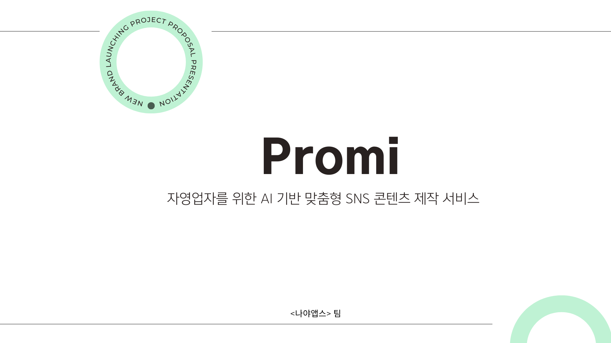
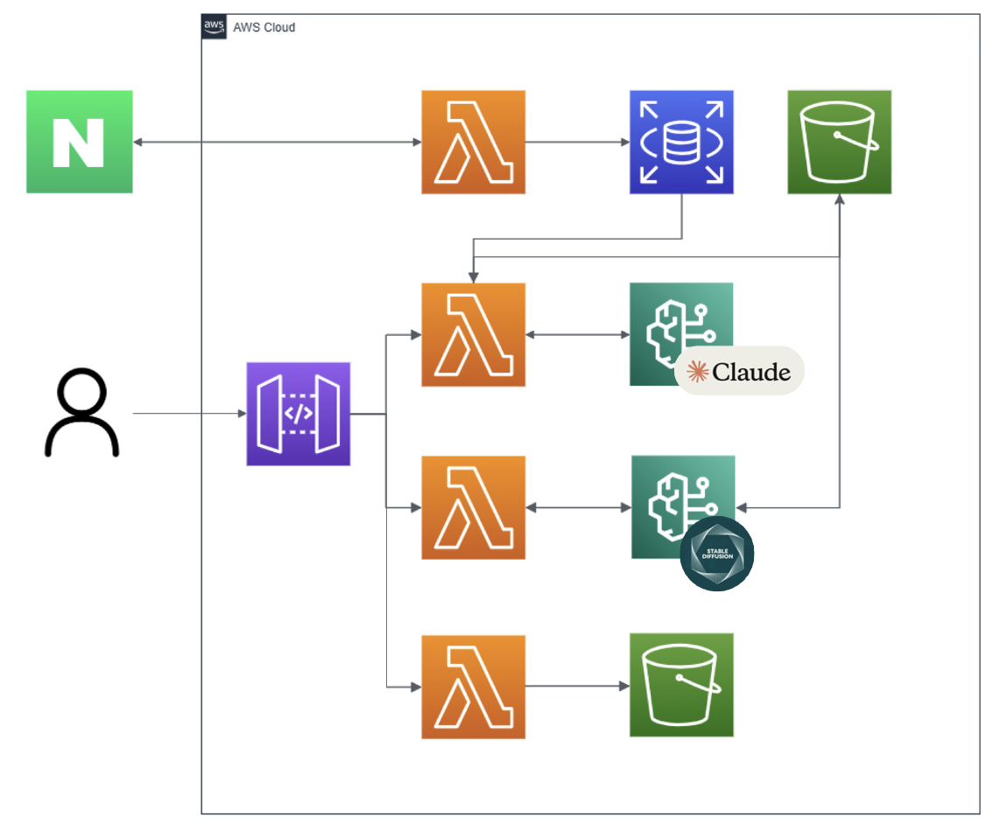
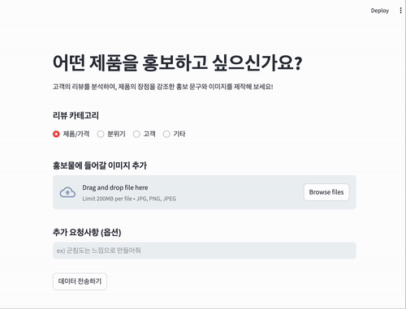
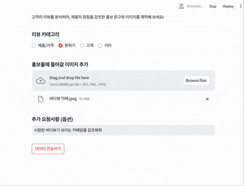
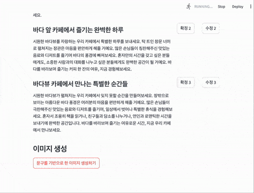

  
🏆 숙명여대 캠퍼스타운 X AWS 'Gen AI Playground Hackathon' - 우수상 수상작 🏆

  <h1>Promi</h1>
  
자영업자를 위한 AI 기반 맞춤형 SNS 콘텐츠 제작 서비스

  

 

## 목차

1. [**대회 소개**](#1)
2. [**서비스 소개**](#2)
3. [**서비스 기획 배경**](#3)
4. [**서비스 타겟**](#4)
5. [**서비스 아키텍쳐**](#5)
6. [**데모 영상**](#6)
7. [**기대 효과**](#7)
8. [**개발 팀 소개**](#8)
9. [**개발 기간**](#9)

 

## 🔎 대회 소개

2024 숙명여대 캠퍼스타운 X AWS ['Gen AI Playground Hackathon'](http://campustown.bnp21.co.kr/user/cmm/selectArticleDetail.do?bbsId=BBSMSTR_000000000005&pageUnit=8&menuId=050100&bbsTyCode=BBST02&nttId=31531)은, AWS 클라우드와 Gen AI를 활용하여 Web/App/Bot을 개발하는 해커톤입니다.

 

## 💻 서비스 소개
### Promi : Promotion + AI의 합성어 [프로미] 
자영업자를 위한 AI 기반 맞춤형 SNS 콘텐츠 제작 서비스

 

## 📍 서비스 기획 배경

### 마케팅의 중요성

> 팔리지 않는다면, 그것은 창의적인 것이 아니다.  - `David Ogilvy (현대 광고의 아버지)` 

### SNS 마케팅의 중요성

- 온라인 고객 유치를 위해 인스타그램, 블로그 등 SNS 활용이 필수적
- 국내 많은 기업이 SNS 마케팅을 통해 기업 이미지 개선과 온라인 마케팅 진행
- SNS 마케팅 활동이 브랜드 인지도, 소비자 만족도, 구매 의도에 미치는 영향이 입증됨

### 숙명여대 캠퍼스타운에 입주된 스타트업의 SNS 분석 (B2C)

- 2024 스마트 푸드테크 랩 1기 데모데이 대상 `‘저스트플래져’(발효 비건 버터를 생산하는 기업)` - SNS 계정 부재
- 2024 스마트 푸드테크 랩 1기 데모데이 우수상 `‘스푼’(고부가가치 쌀 가공식품 생산 스타트업)` - 11개월 동안 총 6개의 SNS 게시물 업로드
- 2024 스마트 푸드테크 랩 1기 데모데이 참여 `‘와이낫’(단백질 쉐이크 자판기를 제조하는 기업)` - 4년간 21개의 SNS 게시물 업로드

 

## 💡 서비스 타겟

### SNS 마케팅이 처음인 요식업 자영업자
- SNS 홍보를 시작하고 싶지만 어떻게 해야 할지 막막한 자영업자

### SNS 본문 작성이 어려운 자영업자
- 매력적인 글과 이미지를 만드는 데 어려움을 느끼는 자영업자

### 우리 가게의 매력을 돋보이고 싶은 자영업자
- 고객 리뷰를 활용해 가게만의 차별화된 특징을 강조하고 싶은 분들

 

## 🛠 서비스 아키텍쳐

### 가게 리뷰 기반 콘텐츠 생성 
- 네이버 리뷰 데이터를 분석하여 인스타그램 마케팅에 활용할 수 있는 [사진 제목] 및 [포스트 본문]을 자동으로 생성

### 분위기 기반 이미지 생성
- 리뷰에서 추출된 가게의 분위기 정보로 SNS 홍보에 최적화된 이미지를 생성하여 감각적인 콘텐츠 제공

 

## 🎥 데모 영상

|           리뷰 카테고리, 이미지, 요청사항 입력 >> 리뷰 데이터 요청            |    
|:---------------------------------------------------------------------------------------: | 
|  | 

|   요청받은 데이터 기반으로 홍보 문구 선택 및 수정 >> 문구 확정    |    
|:---------------------------------------------------------------------------------------: | 
|  | 

|     확정된 문구를 기반으로 한 카드 뉴스 제작          |    
|:---------------------------------------------------------------------------------------: | 
|  | 

 

## 🌟 기대 효과

### 마케팅 접근성 향상
- 자영업자들이 SNS 마케팅을 보다 쉽게 시작할 수 있도록 지원  
- 효율적인 홍보가 가능  

### 고객 이해도 향상
- 리뷰 분석을 통해 고객의 선호도와 기대를 파악  
- 이를 바탕으로 서비스를 개선하여 충성 고객을 확보  

### 브랜드 이미지 강화
- 가게의 분위기와 매력을 반영한 이미지와 본문으로 브랜드 이미지 강화  
- 차별화된 매력을 전달하여 방문 유도 가능  

### 마케팅 비용 절감
- 자동화된 도구를 통해 SNS 마케팅 비용 절감  
- 소규모 자영업자도 저비용으로 고효율 마케팅이 가능  

 

## 👩🏻‍💻 개발 팀 소개

| **역할**      | **프로필**                                                                                      | **이름 (전공)**                      | **작업 내용**                                                                                     |
|:-------------:|:---------------------------------------------------------------------------------------------:|:-----------------------------------:|-----------------------------------------------------------------------------------------------|
| **Back-end**  |   | 경민서 (소프트웨어학부 22)        | - 네이버 리뷰 크롤링 - AWS Bedrock 홍보 문구 생성 기능 구현                                   |
| **Back-end**  |     | 신진영 (소프트웨어학부 20)        | - AWS RDS에 네이버 리뷰 데이터 적재 - AWS S3를 활용해 사용자 업로드 이미지 저장 - AWS RDS에서 필터링된 리뷰 데이터 조회 기능 구현 |
| **Back-end**  |   | 이채은 (소프트웨어학부 22)        | ...                                                                                            |
| **Back-end**  |     | 이해림 (소프트웨어학부 23)        | - 네이버 리뷰 크롤링 - AWS S3에 담긴 최종 프롬프트와 이미지 오버레이 Lambda 구현             |
| **Front-end** |  | 류미성 (소프트웨어학부 21)        | - Streamlit을 이용한 인터랙티브 Front-end 구현                                                                                         |

 

## 📅 대회 기간

2024년 11월 8일 ~ 2024년 11월 9일 (무박 2일)

 
